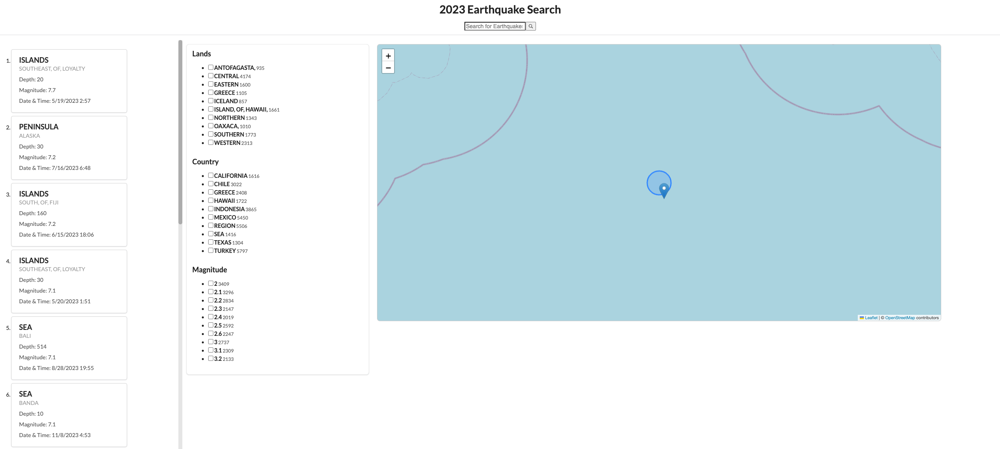

# Algolia 2023 Earthquakes Map

This project uses Algolia's `react-instantsearch` library, `react-leaflet`, and `semantic-ui` to create a basic UI that visualizes earhquake data on a map. The project utilizes [this free dataset](https://www.kaggle.com/datasets/syedanwarafridi/earthquake-events-worldwide-2023) from Kaggle.

The goal of this project was to learn as much as I could about the `react-instantsearch` library. The shape of the project itself was determined by the dataset I chose. Since the data included coordinate data, it seemed like the natural choice to visualize that data on the map. I also implemented semantic UI to make the experience cleaner.

In general, I found the assigment to be fairly straightforward. Implementing my Algolia data was relatively easy to do. Most of the complexity camed from implementing the map portion. Given more time, I would also make the map react when performing a search or toggling a refinement, but I settled on the click to navigate functionality for now. I used `react-leaflet` because the Algolia documentation provided a code sample, however it would have helped if the documentation went into additonal detail here, specifically around how to connect the leaflet map to my Algolia components— it seems I may have been a little limited here because I didn't use the built in geosearch functionality. 

## Using the App

- This project is hosted on github pages, you can find it [here](https://superrockycat.github.io/algolia-earthquake-search-demo/)
- To navigate to a specific earthquake location, simply click one of the cards on the left hand side
- You can also filter the earthquake data by selecting a refinement from the second columm or by searching for a location in the search bar at the top:
![earthquake-search(./earthquake-search.gif]

## Running Locally

- Clone this repo
- From the terminal `cd algolia-earthquake-search-demo`
- `npm install`
- `npm run start`

