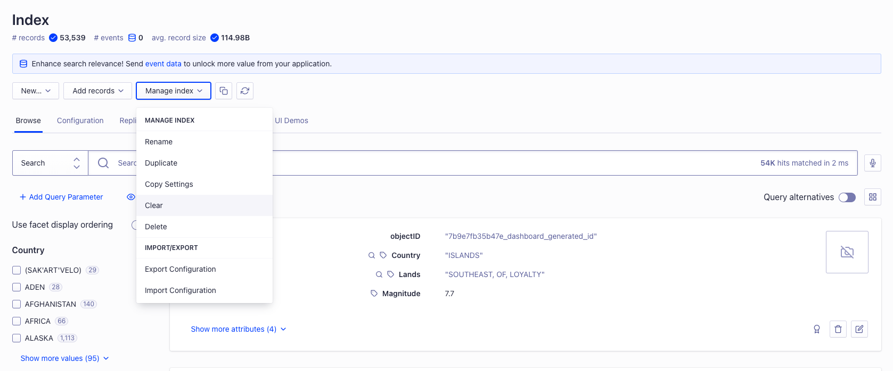

> Question 1: Hello,

> I'm new to search engines, and there are a lot of concepts I'm not educated on. To make my onboarding smoother, it'd help if you could provide me with some definitions of the following concepts:

> Records
> Indexing
> I'm also struggling with understanding what types of metrics would be useful to include in the "Custom Ranking."

> Cheers, George

Hi George,

Thanks for reaching out! No worries, I understand that terms can be a little confusing at first, happy to help you out here.

1) **Records**: Records are the individual pieces of data stored in your search index. In programming terms, you can think of a record as an object with multiple attributes. Your search index is like a special kind of database, capable of storing millions of records and optimizig them for searchability. You can learn more about records in our documentation. We define a record [here](https://support.algolia.com/hc/en-us/articles/4406981906833-What-is-a-record-), and you can learn more about what might kind of data a record might contain [here](https://www.algolia.com/doc/guides/sending-and-managing-data/prepare-your-data/in-depth/what-is-in-a-record/) 
2) **Indexing**: As we mentioned in the last answer, you can think of an **index** as a special kind of datatabase for search records. What makes that database special is is how it organizes the information stored within it to make it searchable and optimized for fast response times. We have an excellent desctiption of this process in our blog [here](https://www.algolia.com/blog/product/what-is-a-search-index-and-how-does-it-work/). Here's a snippet:
>It’s the means by which data is organized and structured so that search engines can generate relevant search results. Search indexing can transform any and all data and file types into searchable data. 
>The goal is to make searching as fast, accurate, and relevant as possible.
>Creating a search index is essentially highlighting, signposting, and telling the search functionality what information is on a page or in a file. When it comes to websites, the search index points out the key terms (“keywords”) that indicate what the page is about, what its purpose is, and what content it should be discovered for. This way, every time someone searches for something, the search functionality looks for the information signposts, eliminating a significant amount of the workload. 

I hope this helps! Let me know if you have any other questions regarding records and indexes.

> I'm also struggling with understanding what types of metrics would be useful to include in the "Custom Ranking."

That's understandable, custom search rankings are going to be highly dependent on the type of data stored in your index— and you don't want to lean on them too much or it might produce confusing results. To determine the right metrics for custom rankings, you'll want to consider scenarios where your search results will be less relevant to users without a custom ranking. I recommend starting with our documentation [here](https://www.algolia.com/doc/guides/managing-results/must-do/custom-ranking/#custom-ranking) to learn more about custom ranking applications. We also dive into some tuning steps [here](https://www.algolia.com/ecommerce-merchandising-playbook/custom-ranking/). 

Additionally, I'd be happy to dive into this deeper with you. Let me know if you'd like to schedule a screenshare to show me the data in your index. With a better idea of the data you're indexing, I should be able help you determine what— if any— custom rankings would be appropriate. Let me know!

Best,
Rocky

> Question 2: Hello,

> Sorry to give you the kind of feedback that I know you do not want to hear, but I really hate the new dashboard design. Clearing and deleting indexes are now several clicks away. I am needing to use these features while iterating, so this is inconvenient.

> Regards, Matt

Hey Matt,

Don't be sorry! We're always open to feedack on the product. Sorry to hear that the new design is causing headaches for you. Are you attempting to clear the Index from the Manage index dropdown like so?:

If not, let me know what your process looks like and how you'd prefer to clear the index and I'll pass it along to our product team. It's also worth highlighting that you can skip using the dashboard entirely to accomplish this task. If index clearing is something you do frequently as part of your development process, this could be easily accomplished by writing a small script that interacts with our API. I'd be happy to show you how to accomplish this in a screenshare as well, just let me know!

Best,
Rocky

> Question 3: Hi,

> I'm looking to integrate Algolia in my website. Will this be a lot of development work for me? What's the high level process look like?

> Regards, Leo

Hi Leo,

Thanks for reaching out! Implementing Algolia shouldn't be a significant amount of development work for you, we have done our best to streamline the setup process and get you building immediately. Here's what it looks like at a high level:

1) [Prepare your search data](https://www.algolia.com/doc/guides/sending-and-managing-data/prepare-your-data/in-depth/prepare-data-in-depth/)
2) [Create an Index](https://www.algolia.com/doc/guides/sending-and-managing-data/prepare-your-data/in-depth/prepare-data-in-depth/)
3) [Add data using one of our connectors](https://www.algolia.com/doc/guides/sending-and-managing-data/send-and-update-your-data/)
4) [Build your search UI using one of our UI libraries](https://github.com/SuperRockyCat/algolia-earthquake-search-demo/new/gh-pages)

I'm confident that the tools we provide will allow you to start using Algolia search data in your application in less than 30 minutes. Once there, it's only a matter of styling the experience and getting things hooked up to your pre-existing components. I'd be happy to walk you through the process using a demo application, and answer any questions you may have. Let me know what your availability looks like over the next few days and we can get something scheduled!

Best,
Rocky
